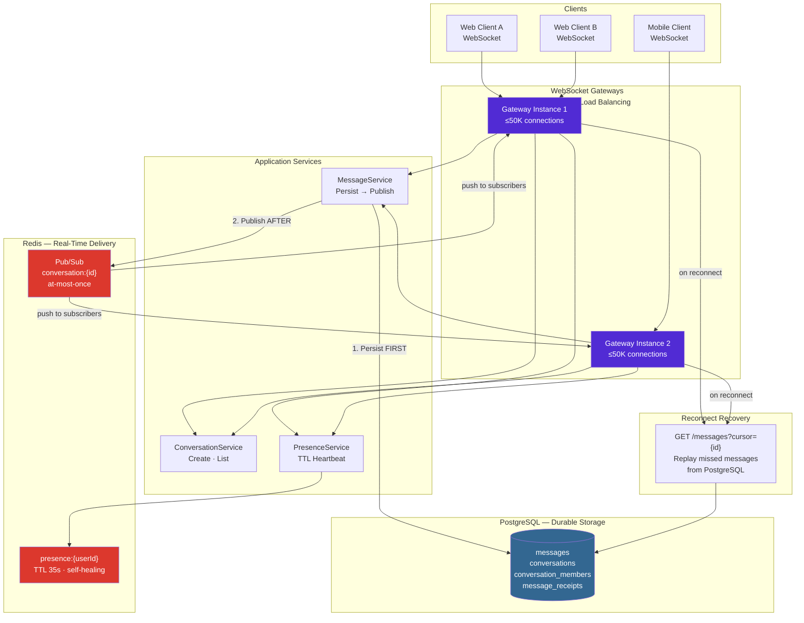

# Real-Time Chat System

A distributed real-time messaging backend built with .NET 8, PostgreSQL for durable message persistence, and Redis pub/sub for cross-instance real-time delivery. Demonstrates the explicit at-most-once tradeoff and the cursor-based reconnect recovery pattern.

---

## Quick Start

```bash
git clone <repo>
cd realtime-chat-system
cp .env.example .env
docker compose up --build
```

- **API:** http://localhost:8082
- **Swagger UI:** http://localhost:8082/swagger
- **Health:** http://localhost:8082/health

---

## Architecture



---

## Why I Built This

The chat system illustrates a fundamental distributed systems tradeoff: exactly-once delivery versus latency. Kafka provides at-least-once durable delivery but adds 10–200ms latency per message due to consumer polling. Redis pub/sub delivers in under 5ms but is at-most-once by design — if a subscriber is momentarily unavailable, the message is dropped. For interactive chat, a missed message recovered on the next reconnect (within seconds) is far better than a 200ms delay on every message. This system makes that tradeoff explicit and designs the recovery path rather than pretending the tradeoff doesn't exist.

---

## Key Design Decisions

**1. Persist before publish.** The message is written to PostgreSQL before the Redis pub/sub PUBLISH call. If the PUBLISH fails (Redis momentarily unavailable), the message is still in the database. The recipient recovers it on reconnect. The reverse order — publish then persist — would leave a message in clients' UIs that doesn't exist in the database: a ghost message.

**2. Cursor-based pagination, not offset.** `GET /messages?cursor={last_message_id}` uses the message ID as the stable cursor. Offset-based pagination (`?page=2&limit=20`) breaks when new messages are inserted between pages — the second page may overlap with the first. Message IDs are monotonically increasing UUIDs that never shift.

**3. Redis pub/sub bridges gateway instances.** Without Redis, a message sent to Gateway-1 would never reach a recipient connected to Gateway-2. The pub/sub channel `conversation:{id}` is subscribed to by all gateway instances that have members of that conversation connected. Redis fan-out is the cross-instance delivery mechanism.

**4. Presence via TTL, not state.** `presence:{userId}` is a Redis key with a 35-second TTL, renewed every 30 seconds by a client heartbeat. A user who loses connectivity without sending a disconnect signal becomes "offline" within 35 seconds — no application logic required. Silent disconnects (airplane mode, tunnel) are handled automatically.

**5. WebSocket affinity via IP-hash.** Unlike the stateless REST API (which uses round-robin), WebSocket connections are long-lived TCP connections. Once established, they must remain on the same gateway instance. IP-hash load balancing ensures the same client IP always routes to the same instance for the duration of the session.

---

## What I Would Improve

- **Message search via Elasticsearch:** full-text search across message history requires an inverted index. PostgreSQL `tsvector` works for small datasets; Elasticsearch is necessary at scale.
- **Read receipts via Kafka:** currently read receipts are written synchronously. At high volume (500-member groups), a Kafka topic for read events would prevent the read receipt path from adding latency to the message send path.
- **End-to-end encryption:** message content is stored in plaintext in PostgreSQL. A proper E2EE implementation (Signal protocol) would ensure the server cannot read message content.

---

## Interview Talking Points

- **The at-most-once tradeoff:** when an interviewer asks "what happens if a message is dropped?", explain that the system is designed for this. Dropped pub/sub messages are recovered via cursor pagination on reconnect. This is an explicit tradeoff — predictability in most cases over guaranteed delivery in all cases.
- **Why Redis pub/sub and not WebSocket fan-out directly:** a single gateway instance could push directly to its connected clients, but this only works if sender and recipient are on the same instance. Redis pub/sub makes message delivery work correctly regardless of which instance each participant is connected to.
- **The persist-then-publish ordering:** explain why reversing this order would be dangerous. If you publish first and the database write fails, clients receive a message that doesn't exist in the authoritative store — they cannot recover it later.

---

## Running the System

```bash
docker compose up --build
```

### Demo Operations

**1. Create a direct conversation**
```bash
curl -s -X POST http://localhost:8082/api/v1/conversations \
  -H "Content-Type: application/json" \
  -H "Authorization: Bearer dev-token" \
  -d '{"type": "direct", "member_ids": ["usr_001", "usr_002"]}' | jq .
```

**2. Send a message**
```bash
CONV_ID="conv_xxx"
curl -s -X POST http://localhost:8082/api/v1/conversations/$CONV_ID/messages \
  -H "Content-Type: application/json" \
  -H "X-Idempotency-Key: $(uuidgen)" \
  -d '{"content": "Hello from the API!"}' | jq .
```

**3. Retrieve message history with cursor**
```bash
curl -s "http://localhost:8082/api/v1/conversations/$CONV_ID/messages?limit=20" | jq .
# Note the cursor in the pagination object, then:
curl -s "http://localhost:8082/api/v1/conversations/$CONV_ID/messages?cursor=MSG_ID&limit=20" | jq .
```

**4. Mark message as read**
```bash
MSG_ID="msg_xxx"
curl -s -X PATCH http://localhost:8082/api/v1/messages/$MSG_ID/read | jq .
```

**5. Check user conversations**
```bash
curl -s http://localhost:8082/api/v1/users/usr_001/conversations | jq .
```
