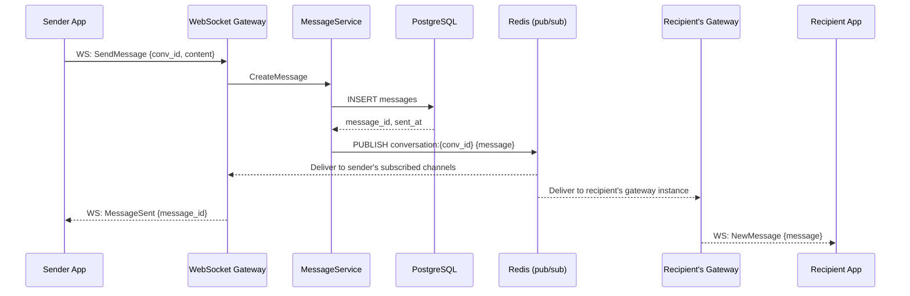
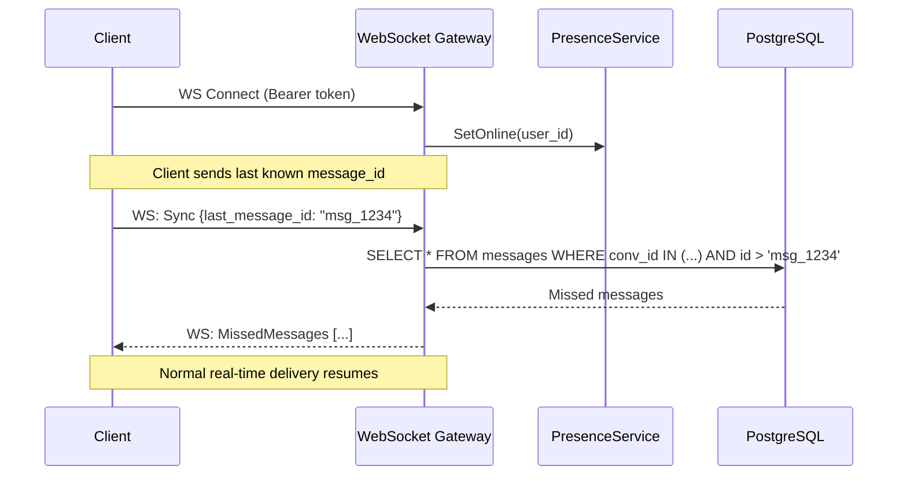
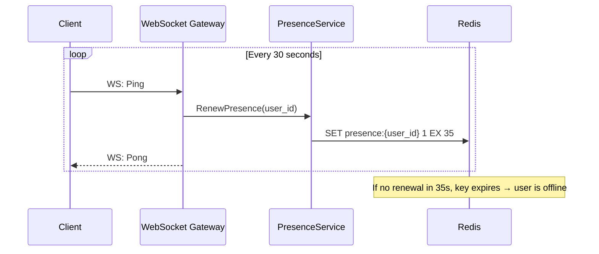

# Requirements — Real-Time Chat System

---

## Functional Requirements

**FR-01** — The system shall allow authenticated users to create a direct (one-to-one)
conversation with another user.

**FR-02** — The system shall allow authenticated users to create a group conversation and
add multiple members.

**FR-03** — Users can send a text message to any conversation they are a member of.

**FR-04** — The system shall deliver messages to all online members of a conversation in
real time via WebSocket push, regardless of which server instance the recipient is connected to.

**FR-05** — The system shall persist every message to durable storage before acknowledging
delivery to the sender.

**FR-06** — The system shall deliver all messages sent during a user's offline period to
that user upon reconnection, in the correct chronological order.

**FR-07** — The API must return a paginated, cursor-based history of messages for any
conversation the requesting user is a member of.

**FR-08** — The system shall track and report each user's online/offline presence status.

**FR-09** — The system shall detect silent disconnections (no explicit logout) and mark
users as offline within 35 seconds.

**FR-10** — Users can mark messages as read, updating their `last_read_message_id` in the
conversation and allowing unread count computation.

**FR-11** — Users can soft-delete a message they sent. The message content is replaced
with a deletion marker; the message record and receipts are retained.

**FR-12** — The system shall allow users to leave a conversation or be removed by the
conversation creator.

---

## Non-Functional Requirements

### Availability

- **NFR-01** — The system shall maintain 99.9% uptime.
- **NFR-02** — A single gateway instance failure must not result in message loss. Affected
  clients reconnect to a healthy instance within 5 seconds and recover missed messages.

### Latency

- **NFR-03** — Real-time message delivery (WebSocket push) p95 ≤ 100ms end-to-end.
- **NFR-04** — `GET /conversations/{id}/messages` p95 ≤ 150ms for pages of 50 messages.
- **NFR-05** — Presence status update propagation p95 ≤ 5,000ms (eventual, not real-time).

### Throughput

- **NFR-06** — The system shall support 100,000 concurrent WebSocket connections.
- **NFR-07** — The system shall sustain 10,000 messages per second at peak.
- **NFR-08** — The system shall handle conversations with up to 500 members.

### Durability

- **NFR-09** — Every message that receives a sent acknowledgement to the sender must be
  permanently persisted and recoverable. Real-time delivery is best-effort; persistent
  delivery is guaranteed.

### Consistency

- **NFR-10** — Message ordering within a conversation is consistent: all recipients observe
  the same sequence of messages.
- **NFR-11** — Presence state is eventually consistent. A user may appear online for up to
  35 seconds after silent disconnection.

### Retention

- **NFR-12** — Messages are retained for a minimum of 90 days and accessible via the
  history API throughout their retention period.

---

## Estimated Traffic.

| Metric                           | Estimate                        |
| -------------------------------- | ------------------------------- |
| Concurrent WebSocket connections | 100,000                         |
| Peak messages per second         | 10,000                          |
| Average message size             | ~512 bytes                      |
| Daily messages stored            | ~500,000,000 bytes (~500MB/day) |
| Conversations active daily       | 500,000                         |
| Message history requests/day     | 2,000,000                       |
| Presence updates/second          | ~5,000 (heartbeats)             |

---

## Data Flow.

### Message Send — Online Recipient

### Reconnect — Offline Message Recovery

### Presence Heartbeat Flow

